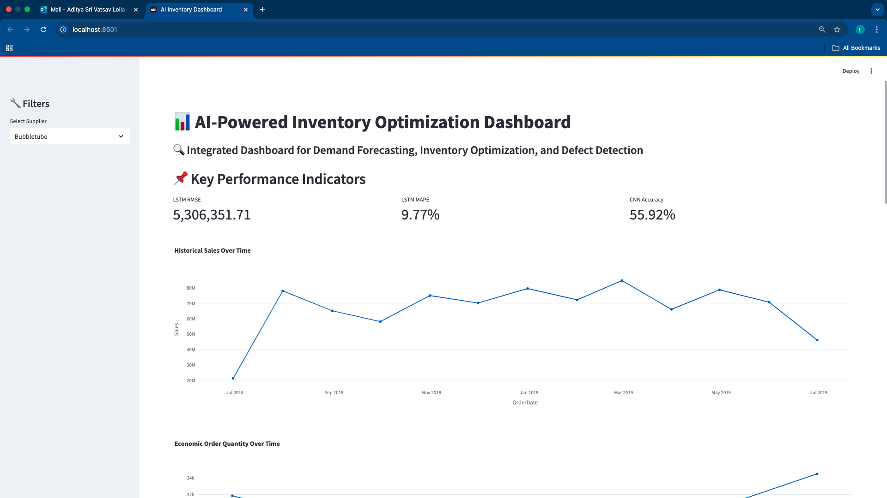

# 📦 SmartStock: AI-Powered Inventory Optimization and Demand Forecasting

## 🎯 **Project Overview**

**SmartStock** is an AI-powered inventory management solution designed to optimize supply chain operations through accurate demand forecasting, dynamic inventory optimization, and automated defect detection. This end-to-end system integrates machine learning and computer vision to minimize costs, improve resource allocation, and enhance decision-making.

---

## 🔍 **Project Goals**

1. 📈 **Demand Forecasting:** Predict future sales trends using machine learning models to optimize stock levels.
2. 📦 **Inventory Optimization:** Implement strategies such as Economic Order Quantity (EOQ) and Just-In-Time (JIT) to reduce inventory costs.
3. 🎯 **Defect Detection:** Use computer vision techniques (CNN) to automatically identify defective parts in real-time.
4. 📊 **Data-Driven Visualizations:** Present actionable insights through dashboards and visualizations.

---

## 🚀 **Prototype Progress and Key Outputs**

### 1️⃣ **Demand Forecasting Using ARIMA and LSTM**

#### 🔧 **ARIMA Model**
- **Purpose:** Predict future demand trends based on historical data.
- **Output:**
  - RMSE: `45,497,368.76`
  - MAPE: `71.43%`
- **Observations:**
  - High error rates indicated the ARIMA model struggled to capture seasonality and complex patterns.

#### 🤖 **LSTM Model**
- **Purpose:** Improve forecast accuracy using a deep learning approach for long-term dependencies.
- **Output:**
  - RMSE: `16,783,985.66`
  - MAPE: `21.61%`
  - Forecasted Sales for the next 3 months:

| Date       | Forecasted Sales |
|------------|------------------|
| 2019-07-31 | 54,650,044.0     |
| 2019-08-31 | 50,461,212.0     |
| 2019-09-30 | 47,025,604.0     |

- **Observations:**
  - Significant improvement in accuracy compared to ARIMA.
  - Reliable forecasts for supporting inventory decisions.

---

### 2️⃣ **Inventory Optimization Using EOQ**

- **Purpose:** Calculate the optimal order quantity to minimize inventory costs.
- **Method:** Economic Order Quantity (EOQ) formula dynamically calculated based on LSTM forecasts.
- **Output:**
  - Example EOQ for forecasted sales:

| Date       | Forecasted Sales | EOQ (Units) |
|------------|------------------|-------------|
| 2019-07-31 | 54,650,044.0     | 1044.06     |
| 2019-08-31 | 50,461,212.0     | 1007.47     |
| 2019-09-30 | 47,025,604.0     | 968.68      |

- **Observations:**
  - EOQ dynamically adjusted for upcoming months.
  - Helps in maintaining optimal inventory levels while reducing holding costs.

---

### 3️⃣ **Defect Detection Using CNN (Planned Implementation)**

- **Purpose:** Detect defective parts using image classification.
- **Method:**
  - Use of Convolutional Neural Networks (CNN) to classify defects from image data.
  - Integrate predictions with inventory management to exclude defective parts.
- **Next Steps:**
  - Prepare and preprocess image datasets.
  - Train and evaluate CNN model.
  - Integrate defect detection results with the inventory system.

---

### 4️⃣ **Visual Insights and Reporting**

- 📊 **Sales Trends Visualization:** Monthly sales trends plotted to identify patterns and fluctuations.
- 📦 **Inventory Levels Visualization:** EOQ vs. forecasted demand tracked over time.
- 📈 **Forecast Accuracy Plot:** Visual comparison of actual vs. predicted sales from the LSTM model.

---

## 🔗 **Technologies Used**

- 🐍 **Python**: Data processing and machine learning model development.
- 📊 **Matplotlib & Seaborn**: Data visualization.
- 🤖 **TensorFlow & Keras**: Building and training LSTM and CNN models.
- 📈 **Statsmodels**: Time-series forecasting using ARIMA.
- 💾 **Pandas & NumPy**: Data manipulation and analysis.
- 🖥 **Streamlit & Plotly**: Interactive dashboards and visualization.
- ☁️ **Google Cloud & Vertex AI**: Deployment and cloud processing.

---

## 📌 **Key Outcomes and Impact**

The prototype demonstrates a comprehensive AI-driven approach to inventory optimization. By integrating demand forecasting, inventory management, and defect detection, SmartStock empowers businesses to:

### 1️⃣ **High Forecast Accuracy with Optimized Inventory**
- If **demand forecasting is highly accurate** and **inventory is optimized**, businesses can reduce holding costs while maintaining sufficient stock levels.
- 🚀 Outcome: Lower wastage and improved supply chain efficiency.

### 2️⃣ **High Defect Detection Accuracy with Low Defect Rates**
- If **defect detection is highly accurate** and **defective parts are minimal**, businesses experience increased sales and fewer customer complaints.
- ✅ Outcome: Higher product quality, leading to better customer satisfaction.

### 3️⃣ **High Defect Detection with High Defect Rates**
- If **defect detection is accurate** but **defective parts are frequent**, this highlights a manufacturing issue that needs immediate attention.
- 🔍 Outcome: Helps companies identify faulty suppliers or quality issues quickly.

### 4️⃣ **Low Forecast Accuracy with Poor Inventory Management**
- If **forecasting accuracy is low** and **inventory is mismanaged**, businesses face stockouts or excess inventory.
- ⚠️ Outcome: Increased costs due to poor supply chain planning, requiring urgent model improvements.

---

## 💡 **Future Enhancements**

1. 🎯 Complete CNN-based defect detection implementation.
2. 📊 Build interactive dashboards for real-time monitoring.
3. 🚀 Deploy the solution on a cloud platform for scalability.
4. 🔒 Integrate alerts for low inventory and high defect rates.
5. 📡 Implement real-time data streaming from IoT-enabled inventory systems.

---

## 🏆 **Final Thoughts**

SmartStock is an innovative AI-powered inventory optimization solution that integrates cutting-edge machine learning and computer vision techniques to drive smarter supply chain decisions. With future enhancements, the platform aims to revolutionize inventory management and improve overall business efficiency.

**Let’s build a smarter future with AI-driven inventory optimization!** 🚀

